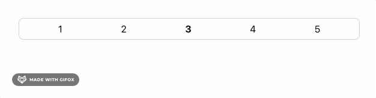
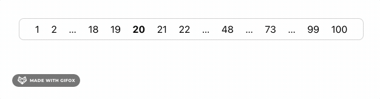
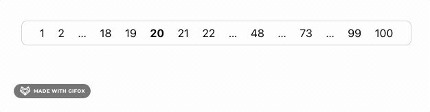

# split-page-numbers

[](https://badge.fury.io/js/split-page-numbers) [](https://github.com/roccivic/split-page-numbers/actions/workflows/build.yml)

This is a stateless page number generator.

The purpose of this package is only to generate a list
of items to be displayed in a pagination control.

Maintaining state, rendering of the actual control and presentation to the user is out of scope.


# Get it

```sh
yarn add split-page-numbers
```

# Use it
## Hello world



```ts
import pager from 'split-page-numbers';

const total = 5;
const current = 2; // page 3 (zero-indexed)

const pages = pager(total, current);

// 1,2,[3],4,5
console.log(pages.toString())

// [
//   {"value":0,"key":"1","isCurrent":false},
//   {"value":1,"key":"2","isCurrent":false},
//   {"value":2,"key":"3","isCurrent":true},
//   {"value":3,"key":"4","isCurrent":false},
//   {"value":4,"key":"5","isCurrent":false}
// ]
console.log(JSON.stringify(pages))
```

## With default options



```ts
const options = {
   // number of items the pager should return
  target: 15,
  neighbours: {
    // number of pages to display
    // near the first and last pages
    edge: 1,
    // number of pages to display
    // on either side of the current page
    current: 2,
  },
  // a gap region to focus on.
  // more on this in the next example
  focus: undefined,
}

const pages = pager(100, 19, options);

// The horizontal ellipsis here surrond a gap region in the page numbers
// 1,2,…3-17…,18,19,[20],21,22,…23-47…,48,…49-72…,73,…74-98…,99,100
console.log(pages.toString())

// [
//   {"value":0,"key":"1","isCurrent":false},
//   {"value":1,"key":"2","isCurrent":false},
//   {"from":2,"to":16,"key":"3-17","isCurrent":false},
//   {"value":17,"key":"18","isCurrent":false},
//   {"value":18,"key":"19","isCurrent":false},
//   {"value":19,"key":"20","isCurrent":true},
//   {"value":20,"key":"21","isCurrent":false},
//   {"value":21,"key":"22","isCurrent":false},
//   {"from":22,"to":46,"key":"23-47","isCurrent":false},
//   {"value":47,"key":"48","isCurrent":false},
//   {"from":48,"to":71,"key":"49-72","isCurrent":false},
//   {"value":72,"key":"73","isCurrent":false},
//   {"from":73,"to":97,"key":"74-98","isCurrent":false},
//   {"value":98,"key":"99","isCurrent":false},
//   {"value":99,"key":"100","isCurrent":false}
// ]
console.log(JSON.stringify(pages))
```

## With a focus region

If a gap region from the previous example is passed to the pager method
in the `options.focus` property, it will include more items in that region.



```ts
const pages = pager(100, 19);
const gap = pages[2];
const focusedPages = pager(100, 19, { focus: gap })

// Note the large gap between pages 22 and 99
// 1,2,3,…4-7…,8,…9-11…,12,…13-16…,17,18,19,[20],21,22,…23-98…,99,100
console.log(pages.toString())

// [
//   {"value":0,"key":"1","isCurrent":false},
//   {"value":1,"key":"2","isCurrent":false},
//   {"value":2,"key":"3","isCurrent":false},
//   {"from":3,"to":6,"key":"4-7","isCurrent":false},
//   {"value":7,"key":"8","isCurrent":false},
//   {"from":8,"to":10,"key":"9-11","isCurrent":false},
//   {"value":11,"key":"12","isCurrent":false},
//   {"from":12,"to":15,"key":"13-16","isCurrent":false},
//   {"value":16,"key":"17","isCurrent":false},
//   {"value":17,"key":"18","isCurrent":false},
//   {"value":18,"key":"19","isCurrent":false},
//   {"value":19,"key":"20","isCurrent":true},
//   {"value":20,"key":"21","isCurrent":false},
//   {"value":21,"key":"22","isCurrent":false},
//   {"from":22,"to":97,"key":"23-98","isCurrent":false},
//   {"value":98,"key":"99","isCurrent":false},
//   {"value":99,"key":"100","isCurrent":false}
// ]
console.log(JSON.stringify(pages))
```

## API
### Imports
```ts
// Interfaces
import { Item, Options, Neighbours } from 'split-page-numbers';

// Classes (implementations of Item)
import { GapItem, NumberItem } from 'split-page-numbers';

// The pager method
import pager from 'split-page-numbers';
```

### Method signature
```ts
Item[] pager(
  total : number,
  current : number,
  options : Options
)
```

### Types
All public types are [here](src/models/public.ts).

The types are bundled with the project, so you can import
the module directly into your TypeScript project.

# Develop it
```sh
yarn # install
yarn build
yarn test
yarn coverage
```
